# Gateway Service Design Document

## Overview

The Gateway Service serves as the primary entry point for the Nexus trading platform, providing comprehensive API Gateway functionality, authentication management, and WebSocket orchestration. This foundational service establishes common packages with shared utilities, implements REST/GraphQL to gRPC conversion, enforces security policies, and manages real-time communication infrastructure. Built on NestJS microservices architecture, it leverages the existing monorepo structure and establishes core architecture patterns that other microservices will depend on.

## Architecture

### High-Level Architecture

```mermaid
graph TB
    %% Client Layer
    subgraph "Client Layer"
        WebApp[🌐 Web Application]
        MobileApp[📱 Mobile App]
        ThirdParty[🔗 Third Party APIs]
    end

    %% Gateway Service Core
    subgraph "Gateway Service"
        direction TB
        Gateway[🚪 Gateway Core]
        
        subgraph "Core Modules"
            Auth[🔐 Authentication Module]
            API[🔄 API Gateway Module]
            WS[⚡ WebSocket Module]
            Kafka[📨 Kafka Module]
            Security[🛡️ Security Module]
        end
    end

    %% External Services
    subgraph "External Infrastructure"
        Redis[(🗄️ Redis<br/>Session Store)]
        DB[(🗃️ PostgreSQL<br/>User Database)]
        KafkaCluster[(📊 Kafka Cluster<br/>Event Streaming)]
    end

    %% Backend Services
    subgraph "Backend Services (gRPC)"
        Trading[📈 Trading Service]
        FinData[💹 FinData Service]
        Notification[🔔 Notification Service]
        UserMgmt[👤 User Management]
    end

    %% Common Packages
    subgraph "Shared Libraries"
        direction LR
        Validation[✅ @nexus/validation]
        Types[🏷️ @nexus/types]
        Utils[🔧 @nexus/utils]
        Proto[📋 @nexus/proto]
        Errors[❌ @nexus/errors]
        Config[⚙️ @nexus/config]
    end

    %% Client Connections
    WebApp --> Gateway
    MobileApp --> Gateway
    ThirdParty --> Gateway

    %% Gateway Internal Flow
    Gateway --> Auth
    Gateway --> API
    Gateway --> WS
    Gateway --> Kafka
    Gateway --> Security

    %% Authentication Flow
    Auth --> Redis
    Auth --> DB
    Auth --> UserMgmt

    %% API Gateway Flow
    API --> Trading
    API --> FinData
    API --> Notification
    API --> UserMgmt

    %% WebSocket Flow
    WS --> Redis
    WS --> KafkaCluster

    %% Kafka Integration
    Kafka --> KafkaCluster
    Kafka --> Trading
    Kafka --> FinData
    Kafka --> Notification

    %% Security Integration
    Security --> Redis
    Security --> DB

    %% Shared Libraries Usage
    Auth -.-> Validation
    Auth -.-> Types
    Auth -.-> Errors
    API -.-> Proto
    API -.-> Types
    API -.-> Utils
    WS -.-> Types
    WS -.-> Config
    Kafka -.-> Types
    Kafka -.-> Config
    Security -.-> Config
    Security -.-> Errors

    %% Styling
    classDef clientStyle fill:#e1f5fe,stroke:#01579b,stroke-width:2px
    classDef gatewayStyle fill:#f3e5f5,stroke:#4a148c,stroke-width:2px
    classDef moduleStyle fill:#fff3e0,stroke:#e65100,stroke-width:2px
    classDef dbStyle fill:#e8f5e8,stroke:#2e7d32,stroke-width:2px
    classDef serviceStyle fill:#fce4ec,stroke:#c2185b,stroke-width:2px
    classDef libStyle fill:#f1f8e9,stroke:#558b2f,stroke-width:2px

    class WebApp,MobileApp,ThirdParty clientStyle
    class Gateway gatewayStyle
    class Auth,API,WS,Kafka,Security moduleStyle
    class Redis,DB,KafkaCluster dbStyle
    class Trading,FinData,Notification,UserMgmt serviceStyle
    class Validation,Types,Utils,Proto,Errors,Config libStyle
```


### Monorepo Structure Integration

The design leverages the existing monorepo setup:

- **Existing Gateway Service**: `apps/gateway-svc` (empty, to be populated)
- **Common Packages**: `libs/*` (to be implemented with shared utilities)
- **NestJS CLI Integration**: All code generation will use `nest generate` commands
- **Workspace Configuration**: Utilizes existing `nest-cli.json` and `package.json` workspace setup
- **Docker Integration**: Containerized deployment with multi-stage builds
- **Development Environment**: Hot reload and debugging capabilities

## Components and Interfaces

### 1. Common Packages Foundation

#### @nexus/validation Package

```typescript
// Shared validation schemas using class-validator
export class CreateUserDto {
  @IsEmail()
  email: string;

  @IsStrongPassword()
  password: string;
}

export class LoginDto {
  @IsEmail()
  email: string;

  @IsString()
  password: string;
}
```

#### @nexus/types Package

```typescript
// Common interfaces and types
export interface User {
  id: string;
  email: string;
  createdAt: Date;
  updatedAt: Date;
}

export interface JwtPayload {
  sub: string;
  email: string;
  iat: number;
  exp: number;
}

export interface SessionData {
  userId: string;
  email: string;
  loginTime: Date;
  lastActivity: Date;
}
```

#### @nexus/proto Package

```protobuf
// gRPC service definitions
syntax = "proto3";

package nexus.gateway;

service AuthService {
  rpc ValidateUser(ValidateUserRequest) returns (ValidateUserResponse);
  rpc CreateUser(CreateUserRequest) returns (CreateUserResponse);
}

message ValidateUserRequest {
  string email = 1;
  string password = 2;
}
```

#### @nexus/config Package

```typescript
// Environment configuration management
export interface DatabaseConfig {
  host: string;
  port: number;
  username: string;
  password: string;
  database: string;
}

export interface RedisConfig {
  host: string;
  port: number;
  password?: string;
}

export interface KafkaConfig {
  brokers: string[];
  clientId: string;
  groupId: string;
  ssl?: boolean;
  sasl?: {
    mechanism: string;
    username: string;
    password: string;
  };
}

export const configuration = () => ({
  database: {
    host: process.env.DB_HOST || 'localhost',
    port: parseInt(process.env.DB_PORT, 10) || 5432,
    // ... other config
  },
  kafka: {
    brokers: process.env.KAFKA_BROKERS?.split(',') || ['localhost:9092'],
    clientId: process.env.KAFKA_CLIENT_ID || 'nexus-gateway',
    groupId: process.env.KAFKA_GROUP_ID || 'nexus-gateway-group',
    // ... other config
  },
});
```

### 2. Gateway Service Core Modules

#### Authentication Module

- **Purpose**: Handle user registration, login, JWT token management
- **Generated with**: `nest g module auth` in gateway-svc
- **Components**:
  - AuthController: REST endpoints for auth operations
  - AuthService: Business logic for authentication
  - JwtStrategy: Passport JWT strategy implementation
  - AuthGuard: Route protection middleware

#### API Gateway Module

- **Purpose**: REST/GraphQL to gRPC conversion and routing
- **Generated with**: `nest g module api-gateway` in gateway-svc
- **Components**:
  - GatewayController: REST API endpoints
  - GraphQLResolver: GraphQL query/mutation resolvers
  - GrpcClientService: gRPC client connection management
  - ResponseTransformer: Format conversion utilities

#### WebSocket Module

- **Purpose**: Real-time communication and session management
- **Generated with**: `nest g gateway websocket` in gateway-svc
- **Components**:
  - WebSocketGateway: Socket.IO server implementation
  - SessionManager: WebSocket session state management
  - EventHandler: Real-time event processing
  - PresenceService: User presence tracking

#### Kafka Event Streaming Module

- **Purpose**: Event-driven communication and message streaming
- **Generated with**: `nest g module kafka` in gateway-svc
- **Components**:
  - KafkaProducerService: Event publishing to Kafka topics
  - KafkaConsumerService: Event consumption and processing
  - EventSerializer: Message serialization/deserialization
  - TopicManager: Topic creation and management
  - DeadLetterHandler: Failed message processing

#### Security Module

- **Purpose**: Security middleware, rate limiting, CORS
- **Generated with**: `nest g module security` in gateway-svc
- **Components**:
  - SecurityMiddleware: Request security processing
  - RateLimitGuard: Rate limiting implementation
  - CorsConfig: CORS configuration
  - SecurityHeaders: Security header management

## Data Models

### User Entity (PostgreSQL)

```typescript
@Entity('users')
export class User {
  @PrimaryGeneratedColumn('uuid')
  id: string;

  @Column({ unique: true })
  email: string;

  @Column()
  passwordHash: string;

  @Column({ default: false })
  isLocked: boolean;

  @Column({ default: 0 })
  failedLoginAttempts: number;

  @CreateDateColumn()
  createdAt: Date;

  @UpdateDateColumn()
  updatedAt: Date;
}
```

### Session Data (Redis)

```typescript
interface SessionData {
  userId: string;
  email: string;
  loginTime: Date;
  lastActivity: Date;
  refreshToken: string;
  deviceInfo?: string;
}

// Redis key pattern: session:{sessionId}
// TTL: 7 days for refresh token sessions
```

### WebSocket Session (Redis)

```typescript
interface WebSocketSession {
  userId: string;
  socketId: string;
  connectedAt: Date;
  lastPing: Date;
  subscriptions: string[];
}

// Redis key pattern: ws_session:{userId}
// TTL: Connection lifetime + 5 minutes
```

### Kafka Event Models

```typescript
// Base event interface
interface BaseEvent {
  eventId: string;
  eventType: string;
  timestamp: Date;
  correlationId: string;
  userId?: string;
  metadata?: Record<string, any>;
}

// Authentication events
interface UserLoginEvent extends BaseEvent {
  eventType: 'user.login';
  payload: {
    userId: string;
    email: string;
    loginTime: Date;
    ipAddress: string;
    userAgent: string;
  };
}

interface UserLogoutEvent extends BaseEvent {
  eventType: 'user.logout';
  payload: {
    userId: string;
    sessionDuration: number;
  };
}

// System events
interface ServiceHealthEvent extends BaseEvent {
  eventType: 'service.health';
  payload: {
    serviceName: string;
    status: 'healthy' | 'unhealthy';
    metrics: Record<string, number>;
  };
}

// Topic configuration
export const KAFKA_TOPICS = {
  USER_EVENTS: 'nexus.user.events',
  SYSTEM_EVENTS: 'nexus.system.events',
  AUDIT_EVENTS: 'nexus.audit.events',
  NOTIFICATION_EVENTS: 'nexus.notification.events',
} as const;
```

## Error Handling

### Standardized Error Response Format

```typescript
export class ApiError {
  code: string;
  message: string;
  details?: any;
  timestamp: Date;
  correlationId: string;
}

export enum ErrorCodes {
  INVALID_CREDENTIALS = 'AUTH_001',
  ACCOUNT_LOCKED = 'AUTH_002',
  TOKEN_EXPIRED = 'AUTH_003',
  RATE_LIMIT_EXCEEDED = 'SECURITY_001',
  VALIDATION_FAILED = 'VALIDATION_001',
}
```

### Error Handling Strategy

- **Global Exception Filter**: Catch and format all exceptions
- **Validation Pipe**: Handle DTO validation errors
- **gRPC Error Mapping**: Convert gRPC errors to HTTP responses
- **Circuit Breaker**: Handle downstream service failures
- **Correlation IDs**: Track errors across service boundaries

## Testing Strategy

### Unit Testing

- **Framework**: Jest (already configured in NestJS)
- **Coverage Target**: 90%+ for critical authentication flows
- **Mock Strategy**: Mock external dependencies (Redis, PostgreSQL, gRPC clients)
- **Generated with**: `nest g service auth --spec` creates test files automatically

### Integration Testing

- **Database Testing**: Use TestContainers for PostgreSQL
- **Redis Testing**: Use ioredis-mock for session testing
- **gRPC Testing**: Mock gRPC client responses
- **WebSocket Testing**: Test real-time communication flows

### End-to-End Testing

- **Framework**: Supertest for HTTP endpoints
- **WebSocket Testing**: Socket.IO client for real-time testing
- **Authentication Flows**: Complete login/logout/refresh cycles
- **Security Testing**: Rate limiting, CORS, input validation

### Performance Testing

- **Load Testing**: Artillery.js for concurrent user simulation
- **WebSocket Load**: Test 1000+ concurrent connections
- **Response Time**: Validate sub-100ms authentication responses
- **Memory Profiling**: Monitor for memory leaks in long-running sessions

## Implementation Approach

### Phase 1: Foundation Setup

1. Configure common packages using NestJS CLI
2. Set up Gateway Service basic structure
3. Implement database connections and Redis client
4. Create basic health check endpoints

### Phase 2: Authentication Core

1. Generate Auth module with NestJS CLI
2. Implement user registration and login
3. Set up JWT token generation and validation
4. Implement session management with Redis

### Phase 3: API Gateway

1. Generate API Gateway module
2. Implement REST to gRPC conversion
3. Set up GraphQL resolver framework
4. Implement request routing and load balancing

### Phase 4: Real-time Communication

1. Generate WebSocket gateway
2. Implement session management for WebSocket connections
3. Set up Kafka event streaming integration
4. Implement real-time event broadcasting

### Phase 5: Security & Monitoring

1. Generate Security module
2. Implement rate limiting and security middleware
3. Set up comprehensive logging and monitoring
4. Implement circuit breaker patterns

## Kafka Event Streaming Integration

### Event-Driven Architecture

The Gateway Service implements comprehensive Kafka integration for reliable event-driven communication across the distributed system.

#### Kafka Producer Service

```typescript
@Injectable()
export class KafkaProducerService {
  private producer: Producer;

  async publishEvent<T extends BaseEvent>(
    topic: string,
    event: T,
  ): Promise<void> {
    try {
      await this.producer.send({
        topic,
        messages: [
          {
            key: event.correlationId,
            value: JSON.stringify(event),
            headers: {
              eventType: event.eventType,
              timestamp: event.timestamp.toISOString(),
            },
          },
        ],
      });
    } catch (error) {
      // Implement retry logic and dead letter queue
      await this.handlePublishError(topic, event, error);
    }
  }

  private async handlePublishError<T extends BaseEvent>(
    topic: string,
    event: T,
    error: Error,
  ): Promise<void> {
    // Retry logic with exponential backoff
    // Dead letter queue for failed events
    // Error logging and monitoring
  }
}
```

#### Kafka Consumer Service

```typescript
@Injectable()
export class KafkaConsumerService implements OnModuleInit {
  private consumer: Consumer;

  async onModuleInit() {
    await this.consumer.subscribe({
      topics: Object.values(KAFKA_TOPICS),
      fromBeginning: false,
    });

    await this.consumer.run({
      eachMessage: async ({ topic, partition, message }) => {
        await this.processMessage(topic, message);
      },
    });
  }

  private async processMessage(
    topic: string,
    message: KafkaMessage,
  ): Promise<void> {
    try {
      const event = JSON.parse(message.value.toString()) as BaseEvent;

      // Route to appropriate handler based on event type
      await this.routeEvent(topic, event);

      // Commit offset after successful processing
    } catch (error) {
      // Handle processing errors
      await this.handleProcessingError(topic, message, error);
    }
  }

  private async routeEvent(topic: string, event: BaseEvent): Promise<void> {
    switch (event.eventType) {
      case 'user.login':
        await this.handleUserLogin(event as UserLoginEvent);
        break;
      case 'service.health':
        await this.handleServiceHealth(event as ServiceHealthEvent);
        break;
      // Additional event handlers
    }
  }
}
```

#### Event Serialization and Schema Management

```typescript
@Injectable()
export class EventSerializer {
  serialize<T extends BaseEvent>(event: T): Buffer {
    // Implement Avro or JSON serialization
    return Buffer.from(JSON.stringify(event));
  }

  deserialize<T extends BaseEvent>(data: Buffer): T {
    // Implement deserialization with schema validation
    return JSON.parse(data.toString()) as T;
  }

  validateSchema<T extends BaseEvent>(event: T): boolean {
    // Schema validation logic
    return true;
  }
}
```

#### Topic Management and Configuration

```typescript
@Injectable()
export class TopicManager {
  private admin: Admin;

  async createTopics(): Promise<void> {
    const topics = Object.values(KAFKA_TOPICS).map((topic) => ({
      topic,
      numPartitions: 3,
      replicationFactor: 2,
      configEntries: [
        { name: 'cleanup.policy', value: 'delete' },
        { name: 'retention.ms', value: '604800000' }, // 7 days
      ],
    }));

    await this.admin.createTopics({ topics });
  }

  async getTopicMetadata(topic: string): Promise<TopicMetadata> {
    const metadata = await this.admin.fetchTopicMetadata({ topics: [topic] });
    return metadata.topics[0];
  }
}
```

#### Dead Letter Queue Handling

```typescript
@Injectable()
export class DeadLetterHandler {
  async handleFailedMessage(
    originalTopic: string,
    message: KafkaMessage,
    error: Error,
    retryCount: number,
  ): Promise<void> {
    const dlqTopic = `${originalTopic}.dlq`;

    const dlqMessage = {
      ...message,
      headers: {
        ...message.headers,
        'original-topic': originalTopic,
        'error-message': error.message,
        'retry-count': retryCount.toString(),
        'failed-at': new Date().toISOString(),
      },
    };

    await this.producer.send({
      topic: dlqTopic,
      messages: [dlqMessage],
    });
  }

  async reprocessDLQMessages(dlqTopic: string): Promise<void> {
    // Implement DLQ message reprocessing logic
  }
}
```

### Event Flow Patterns

#### Authentication Event Flow

1. **User Login**: Gateway publishes `user.login` event to `nexus.user.events`
2. **Session Creation**: Event triggers session creation in Redis
3. **Audit Logging**: Security service consumes event for audit trail
4. **Notification**: Notification service sends welcome message

#### Real-time Event Broadcasting

1. **Service Event**: Backend service publishes event to Kafka
2. **Gateway Consumption**: Gateway consumes event from topic
3. **WebSocket Broadcast**: Gateway broadcasts to connected clients
4. **State Synchronization**: Client state updated in real-time

#### System Health Monitoring

1. **Health Check**: Services publish health events periodically
2. **Monitoring**: Gateway aggregates health data
3. **Alerting**: Unhealthy services trigger alerts
4. **Circuit Breaker**: Gateway adjusts routing based on health

## API Documentation

### Swagger/OpenAPI Integration

The Gateway Service will provide comprehensive API documentation using Swagger/OpenAPI:

#### REST API Documentation

```typescript
// Example controller with OpenAPI decorators
@ApiTags('authentication')
@Controller('auth')
export class AuthController {
  @Post('login')
  @ApiOperation({ summary: 'User login' })
  @ApiBody({ type: LoginDto })
  @ApiResponse({
    status: 200,
    description: 'Login successful',
    type: LoginResponseDto,
  })
  @ApiResponse({ status: 401, description: 'Invalid credentials' })
  async login(@Body() loginDto: LoginDto): Promise<LoginResponseDto> {
    // Implementation
  }
}
```

#### Documentation Components

- **Interactive Swagger UI**: Available at `/api/docs` for testing endpoints
- **OpenAPI Schema**: Auto-generated from decorators and DTOs
- **Authentication Documentation**: JWT token usage and security schemes
- **Error Response Documentation**: Standardized error formats and codes
- **Request/Response Examples**: Real-world usage examples for all endpoints

#### GraphQL Documentation

- **GraphQL Playground**: Interactive query testing interface
- **Schema Documentation**: Auto-generated from resolvers and types
- **Subscription Documentation**: Real-time event schema definitions

#### WebSocket Documentation

- **Event Documentation**: Message formats and event types
- **Connection Guide**: Authentication and session management
- **Real-time Flow Examples**: Common usage patterns

### NestJS CLI Usage Strategy

- Use `nest generate` for all module, service, controller, and guard creation
- Leverage NestJS decorators and dependency injection
- Follow NestJS best practices for module organization
- Use NestJS testing utilities for test generation
